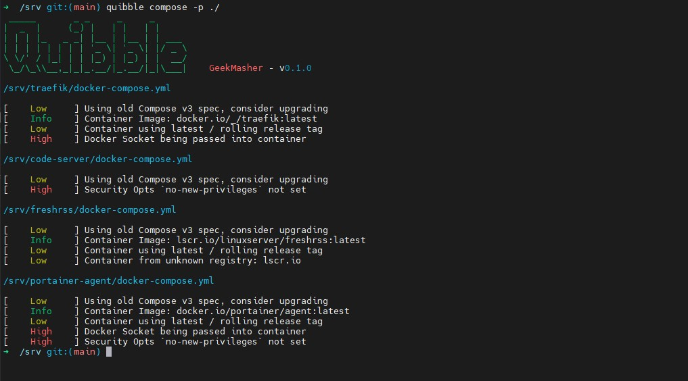

<div align="center">
<h1>Quibble</h1>

[](https://github.com/GeekMasher/quibble)
[](https://github.com/GeekMasher/quibble/actions/workflows/rust.yml?query=branch%3Amain)
[](https://github.com/GeekMasher/quibble/issues)
[](https://github.com/GeekMasher/quibble)
[](https://crates.io/crates/quibble/)
[](./LICENSE)

</div>

A container security tool written in Rust focusing on making security easy for compose based configurations.

## Installing

### Crates.io

```bash
cargo install quibble
```

### Cargo CLI - From source

```bash
git clone https://github.com/GeekMasher/quibble
cd quibble
cargo install --path .
```

### Actions

```yml
- name: Quibble Scan
  uses: GeekMasher/quibble@0.3.1
```

## Usage

Quibble runs in many modes (more to come soon)

#### Compose

`compose` finds all compose files and runs a set of rules on the parsed compose files.

```bash
quibble compose --help
```

This is a very simple util to quickly scan and detect various security or information about the compose files found in a simple view.

```bash
quibble compose --path /srv
```



## Contributing

Contributions are absolutely, positively welcome and encouraged!
Contributions come in many forms. You could:

1. Submit a feature request or bug report as an [issue].
2. Ask for improved documentation as an [issue].
3. Comment on [issues that require feedback].
4. Contribute code via [pull requests].

[issue]: https://github.com/GeekMasher/quibble/issues
[issues that require feedback]: https://github.com/GeekMasher/quibble/issues?q=is%3Aissue+is%3Aopen+label%3A%22feedback+wanted%22
[pull requests]: https://github.com/GeekMasher/quibble/pulls

We aim to keep Quibble's code quality at the highest level. This means that any
code you contribute must be:

- **Commented:** Complex and non-obvious functionality must be properly
  commented.
- **Documented:** Public items _must_ have doc comments with examples, if
  applicable.
- **Styled:** Your code's style should match the existing and surrounding code
  style.
- **Simple:** Your code should accomplish its task as simply and
  idiomatically as possible.
- **Tested:** You must write (and pass) convincing tests for any new
  functionality.
- **Focused:** Your code should do what it's supposed to and nothing more.

## License

All the code in this repository is under the [MIT License](./LICENSE).
